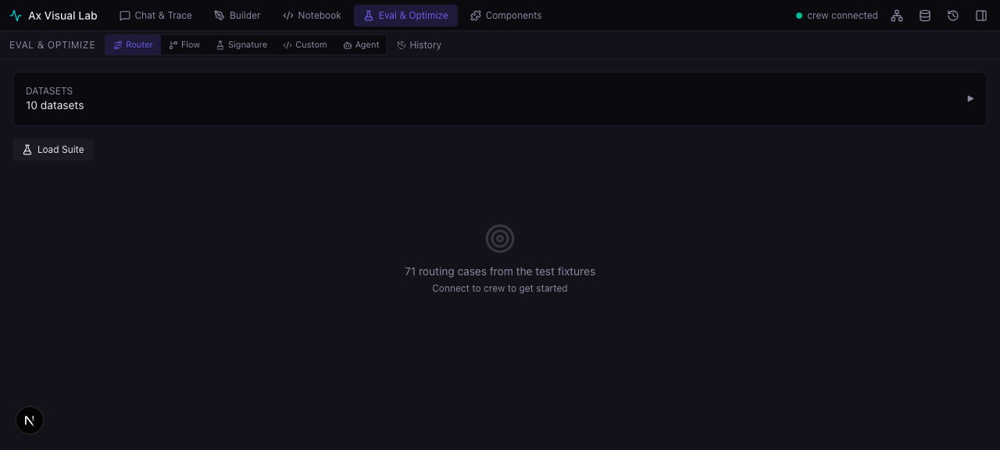
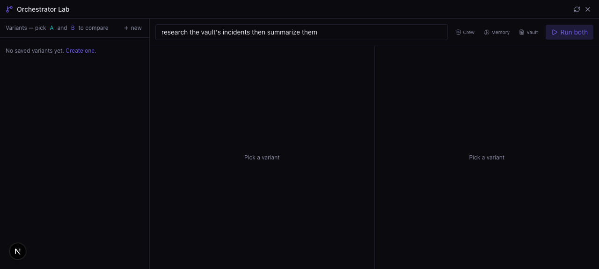
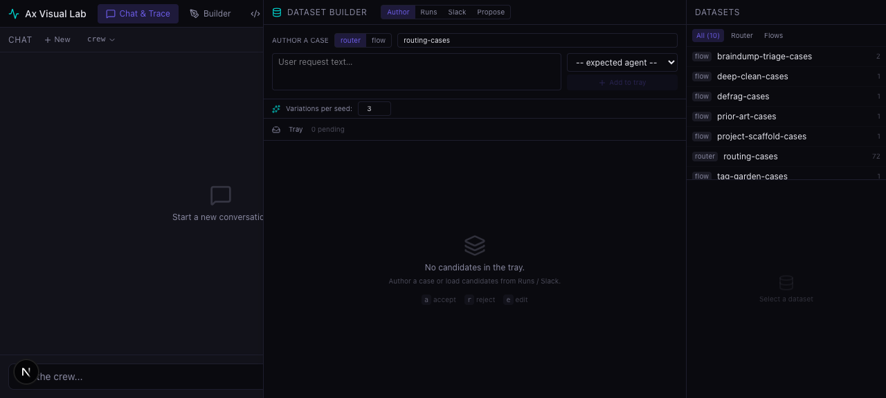
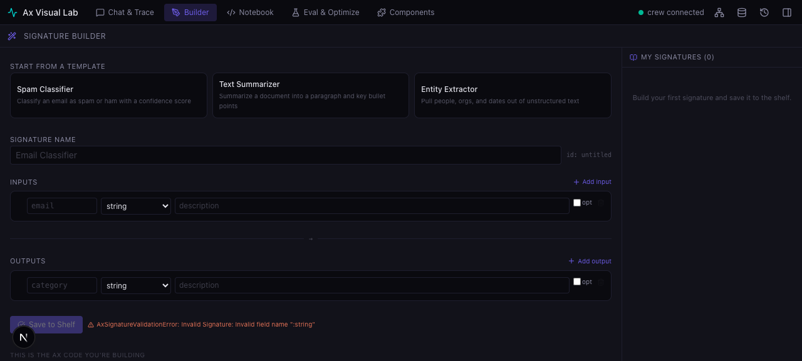
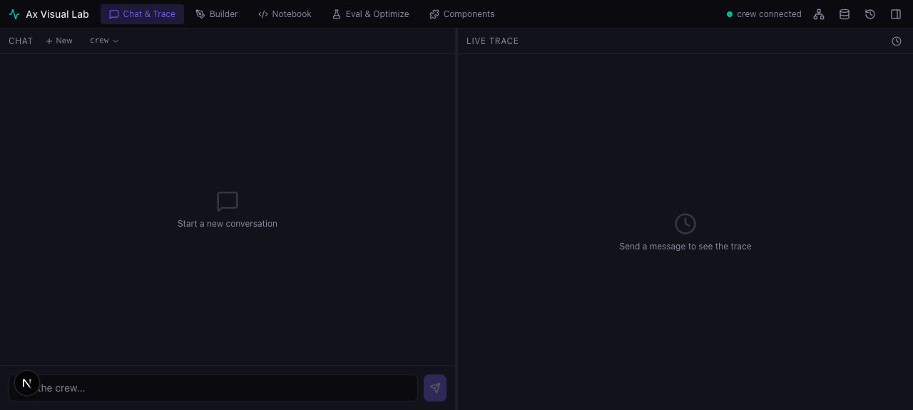
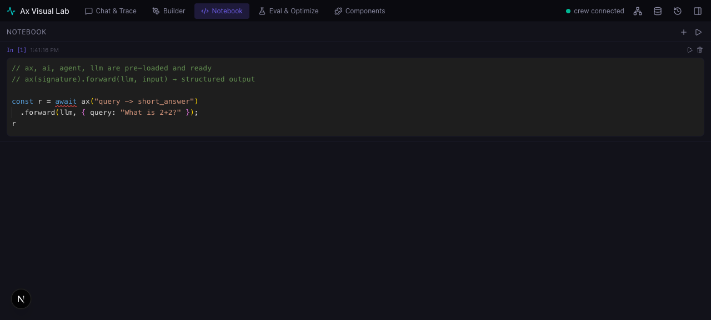
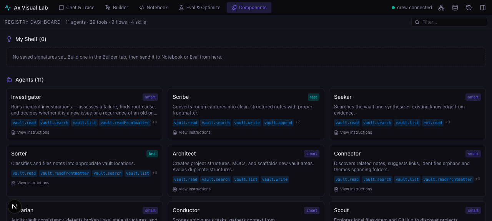

# Ax Visual Lab

**An eval-first workbench for AI agents** — powered by [AxLLM](https://ax-llm.com), the TypeScript agent framework with typed signatures, built-in evals, and ACE self-improvement.

Chat with agents. Trace every decision. Evaluate against datasets. GEPA-optimize from results. Build typed signatures. Let agents learn from every run.

<p align="center">
  
</p>

---

## Why This Exists

Most AI agent tools are black boxes — you send a prompt, get a response, hope it was right. **Ax Visual Lab** makes the entire agent lifecycle inspectable and measurable:

| Stage | What the Lab Gives You |
|-------|----------------------|
| **Build** | Visual signature editor → compiled Ax DSL, validated live |
| **Run** | Live trace panel — every routing decision, tool call, model invocation |
| **Evaluate** | Dataset-driven evals with deterministic metrics + experiment persistence |
| **Improve** | GEPA optimization of signatures + routing from eval results |
| **Learn** | ACE playbooks — agents learn rules from every run, avoid past failures |

---

## The Eval Pipeline

The lab is built around a **dataset-driven eval loop**:

```
                    ┌──────────────────┐
                    │  Dataset Builder  │
                    │  4 sources:       │
                    │  Author · Runs    │
                    │  Slack · AI-propose│
                    └────────┬─────────┘
                             │ cases
                             ▼
┌──────────────┐    ┌──────────────────┐    ┌──────────────────┐
│  Agents       │───▶│  Eval Runner      │───▶│  Experiment       │
│  Signatures   │    │  Router · Flow    │    │  History          │
│  Flows        │    │  Signature · Agent│    │  Persisted +      │
│               │    │  Custom program   │    │  replayable       │
└──────────────┘    └────────┬─────────┘    └──────────────────┘
                             │
                             ▼
                    ┌──────────────────┐
                    │  Optimization     │
                    │  GEPA tune        │
                    │  signatures +      │
                    │  routing           │
                    └──────────────────┘
```

### What's Being Evaluated

| Mode | What It Runs | Metric |
|------|-------------|--------|
| **Router** | The classifier → which agent did it pick? | Deterministic exact-match + escalation scoring |
| **Flow** | Any of 9 flow pipelines (triage, clean, audit, scaffold…) | Per-flow templates with field-level checks |
| **Signature** | Any typed AxLLM signature from the bench | Configurable scorer (code or LLM judge) |
| **Agent** | Any registered agent against a prompt set | Structured output validation + accuracy |
| **Custom** | Arbitrary `ax()` program against cases | User-defined scoring function |

### Built-in Metrics

9 flows ship with **deterministic metric templates** — scoring functions you can edit inline:

<p align="center">
  
</p>

Plus an **incident scoring engine** for the Investigator agent — extracts verdict (NEW/RECURRING/POSSIBLY-RELATED), prior-incident identification, failure-mode classification, and category from free-text agent responses. Weighted scoring (0.5 verdict, 0.3 recurrence evidence, 0.2 category).

---

## ACE Playbooks — Agents That Learn

Every agent has an **ACE playbook** (Agent Continuous Evolution) — a living document of rules that improves from every run:

<p align="center">
  
</p>

### How It Works

1. **Seed** — each agent starts with canonical rules (9–11 rules per agent, from their instruction prompt)
2. **Learn** — after every run, AxLLM evaluates the agent's performance and adds signals:
   - Rules that helped → reinforced (`helpfulCount++`)
   - Rules that were violated → recorded as `failures_to_avoid`
3. **Evolve** — supervised updates: human reviews proposed changes, accepts/rejects
4. **Snapshot** — freeze named versions for A/B comparison ("baseline", "experiment-3")
5. **Reset** — revert to seed at any time

### What's in the playbooks

| Section | Purpose |
|---------|---------|
| `rules` | Canonical behavioral rules — search first, cite evidence, never delete, handoff protocols |
| `failures_to_avoid` | Patterns that caused failures in past runs, learned automatically |

Playbooks persist as JSON in `data/playbooks/` with an event log (JSONL) tracking every lifecycle change — helpful count, harmful count, signals, skip reasons, feedback.

The lab's **Playbooks tab** (in Inspector) shows stats (bullet count, token estimate), recent events, and provides full CRUD — add, edit, delete, pin bullets. You can evolve a playbook from the UI by sending an agent's playbook history to a teacher model.

---

## Dataset Builder

Curate eval datasets from four sources — no manual JSON editing required:

<p align="center">
  
</p>

| Source | How It Works |
|--------|-------------|
| **Author** | Type cases directly — request text + expected agent/output |
| **Runs** | Select from run history — one-click "send to tray", accept/reject |
| **Slack** | Pull reviewed override pairs from the bridge |
| **Propose** | AI analyzes recent runs and proposes gap-filling cases |

Features:
- **Candidate tray** — review, accept, reject batches
- **Variation generation** — expand one case into N variants
- **Coverage analysis** — per-route counts, thin spots highlighted, one-click "fill gap"
- **Export/import** — JSON datasets, portable across instances
- **Regression flagging** — mark cases where the agent previously failed
- **Promote to eval** — move a dataset into the evals directory for CI runs

---

## Bench Shelf

A persistent artifact registry shared across all panels. Save signatures, eval results, and generator configs. Push artifacts from the shelf into the notebook, eval panel, or builder.

<p align="center">
  
</p>

- **Builder → Bench** — save typed signatures
- **Eval → Bench** — save experiment results
- **Bench → Notebook** — scaffold an `ax()` call from any signature
- **Bench → Builder** — edit a saved signature

---

## All Panels

### 🗣️ Chat & Trace
Talk to any agent. The trace panel shows every routing decision, tool call, model invocation, and timing.

<p align="center">
  
</p>

### 📓 Live Notebook
Run JavaScript against the AxLLM runtime. `ax()`, `ai()`, `agent()` pre-loaded. Each cell returns typed results — JSON, Mermaid, or HTML.

<p align="center">
  
</p>

### 🧩 Components & Inspector
Browse agents, tools, flows. View playbook stats. Jump to source. Push instructions into the notebook.

<p align="center">
  
</p>

---

## Quick Start

### 1. Clone and install

```bash
git clone https://github.com/toasterman234/ax-brain-crew.git
cd ax-brain-crew
cp .env.example .env
npm install
```

### 2. Set your LLM key

```bash
OPENAI_API_KEY=sk-your-key-here
OPENAI_BASE_URL=https://api.openai.com/v1   # or any OpenAI-compatible endpoint
```

### 3. Start

```bash
# Terminal 1 — crew backend
npm run crew -- serve --demo

# Terminal 2 — visual lab
npm run dev --prefix apps/lab
```

Open `http://localhost:3020`.

### Docker

```bash
export OPENAI_API_KEY=sk-your-key-here
docker-compose up
```

---

## Adding Your Own Agent

Agents are **YAML config + Markdown instructions**. The AxLLM runtime handles reasoning, tool calling, and structured output. You describe what the agent is and when to use it.

### 1. Write the instruction prompt

`crew/agents/my-agent.md`:

```markdown
# Code Reviewer
## Identity
You are a thorough code reviewer. Find bugs, security issues, and suggest improvements.

## Rules
- Check for injection, XSS, auth bypass
- Check for logic errors and edge cases
- Be specific — cite line numbers, suggest concrete fixes

## Output Format
Return structured output: summary, issues[], suggestions[]
```

### 2. Register

Add to `crew/registry.yaml`:

```yaml
code-reviewer:
  name: Code Reviewer
  description: Reviews code for bugs and security
  instructions: crew/agents/code-reviewer.md
  modelTier: smart
  allowedTools:
    - code.read
  triggers:
    - review this code
    - check my code
    - code review
  handoffs:
    allowedTargets: []
```

### 3. Restart

```bash
npm run crew -- serve --demo
```

Your agent appears in the Inspector, gets a seeded ACE playbook, and responds to trigger phrases. The YAML is the settings panel; Ax is the engine.

---

## Project Structure

```
ax-brain-crew/
├── apps/lab/              Visual Lab (Next.js 15 + React 19 + Zustand)
│   └── src/
│       └── components/    16 panels
├── src/
│   ├── evals/             Metric engines — routing, flow, incident scoring
│   ├── playbooks/         ACE playbook system — seed, persist, edit, evolve
│   ├── persistence/       SQLite + eval experiment persistence
│   ├── agents/            Tool factory — 24 tools as AxLLM fn() calls
│   ├── flows/             9 Ax-native flow() pipelines
│   ├── runtime/           Dispatcher, executor, handoff protocol
│   ├── routing/           Classifier + policy enforcer
│   └── tools/             24 tools (vault, web, memory, GitHub, code, …)
├── crew/
│   ├── agents/            Agent instruction prompts (Markdown)
│   └── registry.yaml      Agent definitions (YAML)
├── demo-vault/            Sample vault for quick start
├── tests/                 Vitest — 30+ test files
├── docs/                  Architecture + screenshots
└── docker-compose.yml     One-command Docker setup
```

---

## Configuration

| Env Var | Default | Description |
|---------|---------|-------------|
| `OPENAI_API_KEY` | (required) | Your API key |
| `OPENAI_BASE_URL` | `https://api.openai.com/v1` | Custom endpoint |
| `ROUTER_MODEL` | `gpt-4.1-mini` | Model for request classification |
| `FAST_MODEL` | `gpt-4.1-mini` | Model for fast-tier agents |
| `SMART_MODEL` | `gpt-4.1` | Model for smart-tier agents |
| `OBSIDIAN_VAULT_PATH` | (empty) | Real Obsidian vault (enables vault tools) |
| `CREW_DEMO_MODE` | `false` | Skip personal integrations |

---

## License

MIT
